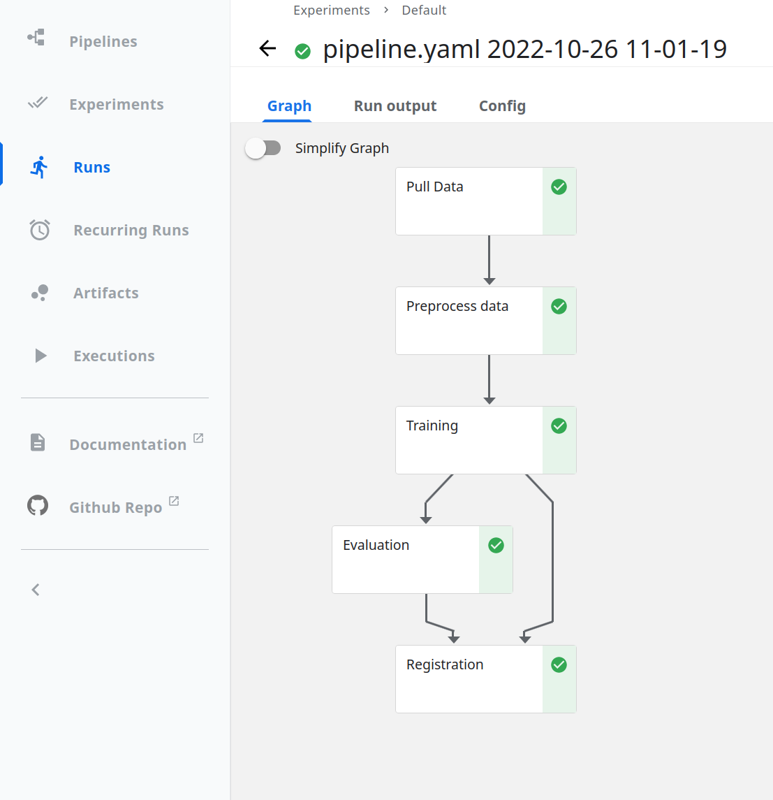

<h1> Model Training Pipeline Overview </h1>

This tutorial guides you through building a simple ML training pipeline.

This tutorial uses [MLFlow](https://mlflow.org/) to track the experiment and register the model, and [Kubeflow Pipeline](https://www.kubeflow.org/docs/components/pipelines/introduction/) to orchestrate repeatable workflow and run workflows with different parameters.

[TOC]



## Why ML training pipeline

In the first phase of an ML project, the process to develop an ML model is manual. Each step of the process, including data analysis, data preparation, model training, and validation, requires manual execution and manual transition from one step to another. This leads to several problems:

- Slow iteration of model development and release which makes the solution fails to adapt to changes in the real-world environment.
- Disconnection between ML (Data Scientists who create the model) and operations (Engineers who serve the model). This leads to discrepancies between the experiment and the production environment, which also causes the solution more likely to fail in production.

The ML training pipeline is the first step to address the issues and is the prerequisite for further automation. For instance, the training pipeline can be triggered when there is a data shift to produce a new model that can adapt to the new data. This can be further integrated with other pipelines such as the model deployment pipeline.

Changes when building an ML training pipeline: 

- Modularized code for components and pipelines: Instead of having all the model training code living in a notebook, the code should be broken down into steps, and containerized into reusable, composable, and potentially shareable components.
- Instead of deploying a trained model as an inference service, the whole training pipeline is deployed.

## Building a Pipeline

A pipeline is a definition of a workflow that is composed of a set of input parameters and a list of the steps in this workflow.

Hence, when building a pipeline, you need to think about how to split our ML workflow into steps. More instructions on [designing a pipeline](https://www.kubeflow.org/docs/components/pipelines/sdk/build-pipeline/#designing-your-pipeline) and [designing components](https://www.kubeflow.org/docs/components/pipelines/sdk/best-practices/).

The steps are:

- [pull data](../training/pull_data.py): Pull the data.
- [pull data](../training/preprocess_data.py): Preprocess the data.
- [train the model](../training/train.py): Train the model and track the experiment on MLFlow.
- [evaluate the model](../training/evaluate.py): Evaluate the model against the given metrics threshold.
- [register the model](../training/register.py): Register the model to the model registry through MLFlow.

In this example, ML workflow contains the steps written as testable Python CLI script.

The steps inputs and outputs are paths passed in from the command-line arguments.

## Pipeline Components

### Containerizing components

A pipeline component is a self-contained set of user code, packaged as a Docker image.

In this example, a common Docker image is used for all the components. This is because all the components source code reside in a single Python package. The Docker image can be found [here](../docker/Dockerfile.train).

### Components and Pipeline definition

The pipeline components and definition are implemented in the pipeline folder.

In this example, the components are defined as yaml in the [components/](../pipeline/components) directory.

These components are loaded and arranged into a pipeline definition in the [pipeline/pipeline.py](../pipeline/pipeline.py) script.

The [pipeline/compile.py](../pipeline/compile.py) script takes compile-time arguments such as image tag as input, compiles the components, and builds a pipeline function representing a KFP pipeline.
This function also defines how data are passed between components. For example, the outputs of the `pull_data_component` are used as the inputs for the `preprocess_data_component`:

```python
pull_data_component = load_component(
    filename="pull_data_component.yaml", cfg=cfg, image_tag=image_tag
)
pull_data_step = pull_data_component()

preprocess_data_component = load_component(
    filename="preprocess_data_component.yaml", cfg=cfg, image_tag=image_tag
)
preprocess_data_step = preprocess_data_component(
    input_data=pull_data_step.output
)
```

You can compile the pipeline into a yaml file by running the [pipeline/compile.py](../pipeline/compile.py) script:

```bash
python -m pipeline.compile IMAGE_TAG [--output pipeline.yaml]
```

This command will create a pipeline.yaml file which contains the definition of the training pipeline.

Finally, the [`pipeline/submit.py`](../pipeline/submit.py) script will take the compiled pipeline yaml file, and submit to KFP to trigger a run of the training pipeline.

```bash
# switch kubectl context
kubectl config use-context <your-cluster>

# submit and run the defined pipeline
python -m pipeline.submit [--pipeline-file pipeline.yaml] [--wait/--no-wait] [--register/--no-register]
```

The optional flags are:

- `--wait/--no-wait`: Whether to wait until the Kubeflow pipeline finishes execution.
- `--register/--no-register`: Whether to run model registration step.

You can monitor the pipeline using Kubeflow dashboard

```bash
kubectl port-forward -n kubeflow svc/ml-pipeline-ui 8080:80
```

Then, the dashboard should be available at [http://localhost:8080](http://localhost:8080).
