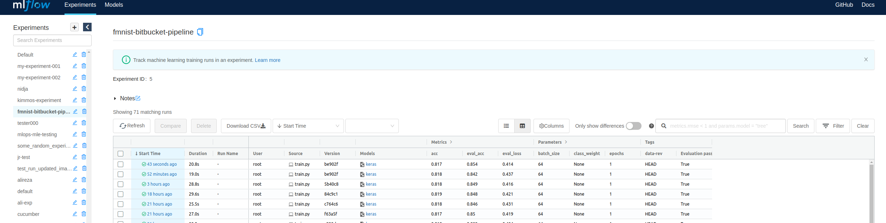
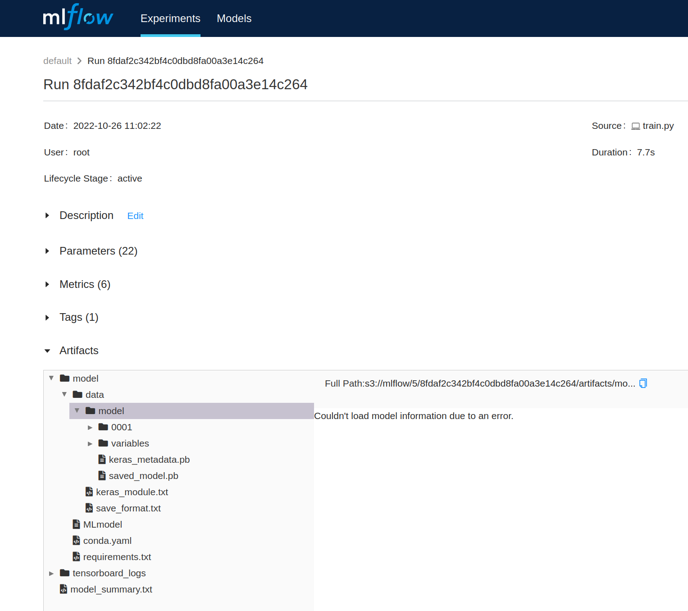
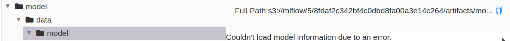

<h1> Manual Model Deployment </h1>

[TOC]

## Overview

This tutorial will guide you on how to manually deploy a trained model.

The model will be hosted by a KServe serverless inference service.

## Deployment Steps

The steps are as follows:

1. Copy the model artifact URI, from a concrete MLFlow experiment run, opened from the MLFlow experiments view: 

   <br>

   

   <br>
   
   

   <br>
   
   

   <br>
   
   Note that the artifact URI should be something similar to `s3://mlflow/<Integer>/<ID>/artifacts/model/data/model`.

   <br>

2. Create a `inference-service.yaml` manifest and paste URI in the `storageUri:` variable. E.g.

   ```yaml
   apiVersion: "serving.kserve.io/v1beta1"
   kind: "InferenceService"
   metadata:
     # your model name here
     name: "fmnist"
     namespace: "kserve-inference"
     annotations:
       prometheus.io/scrape: "true"
       prometheus.io/path: /metrics
       prometheus.io/port: "9090"
   spec:
     predictor:
       serviceAccountName: "kserve-sa"
       tensorflow:
         resources:
           limits:
             cpu: '0.5'
             memory: 0.5Gi
           requests:
             cpu: '0.5'
             memory: 0.5Gi
         # your saved model URI here
         storageUri: "gs://<your-artifact-uri>"
   ```

3. Deploy the model to the configured Kubernetes cluster:

    ```bash
    kubectl apply -f inference-service.yaml
    ```

## Make a prediction
   
Forward a port to the Istio ingress gateway:

```bash
kubectl port-forward --namespace istio-system svc/istio-ingressgateway 8080:80
```

Open another terminal and run:

```bash
# tutorials/
export NAME=fmnist
export INGRESS_HOST="127.0.0.1"
export INGRESS_PORT="8080"
export SERVICE_HOSTNAME=$(kubectl get inferenceservice $NAME -n kserve-inference -o jsonpath='{.status.url}' | cut -d "/" -f 3)

curl -v -H "Host: ${SERVICE_HOSTNAME}" http://${INGRESS_HOST}:${INGRESS_PORT}/v1/models/${NAME}:predict -d @./resources/fmnist-sample-input.json
```
